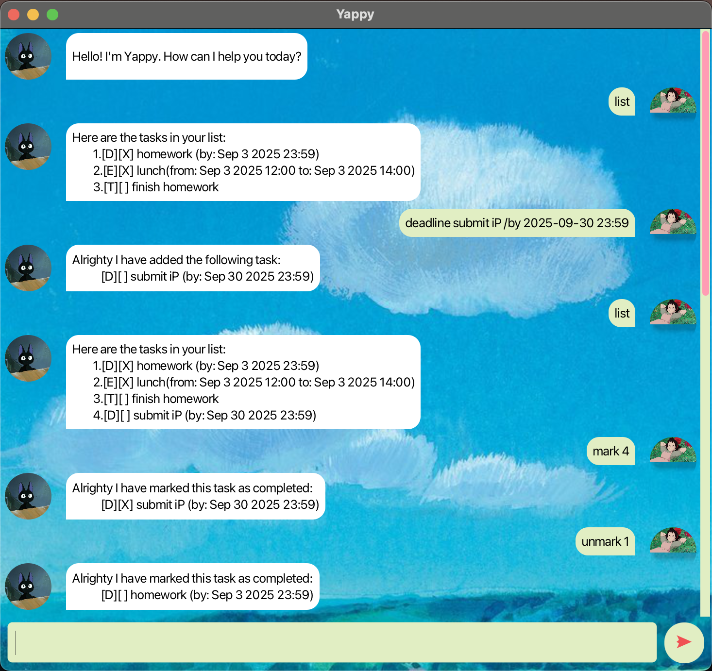

# Yappy User Guide



Yappy is a versatile task management application designed to help you organize your tasks efficiently. 

This guide provides an overview of its features and how to use them effectively.

---
## Quickstart
1. Run the application on your desired device.
2. You will see a greeting message from Yappy.
3. Type your commands in the text box at the bottom of the window.
4. Press the ➤ button to execute your command.
5. Some examples you can try:
   - `todo Read textbook`: add a normal task
   - `deadline Submit assignment /by 2024-10-01 23:59`: add a task with a deadline
   - `event Team meeting /from 2024-09-15 13:00 /to 2024-09-15 15:00`: add an event task with a start and end date and time
   - `list`: list all your tasks
   - `mark 1`: mark the first task as completed
   - `unmark 1`: mark the first task as uncompleted
   - `delete 2`: delete the second task
   - `find book`: find all tasks with the keyword "book"
   - `postpone 3 /by 2024-10-05 23:59`: postpone the deadline of the third task
   - `reschedule 4 /from 2024-09-20 14:00 /to 2024-09-21 16:00`: reschedule the fourth event task
6. For more details on each command, refer to the sections below.

Yappy is a **CLI based application**, so all interactions are done through text commands.

Yappy offers the following commands to help you manage your tasks:

```
todo
deadline
event
find
list
delete
mark/unmark
postpone
reschedule
```
---

## Adding todos: ```todo```

Format: ```todo [DESCRIPTION]```

Action description: Adds a todo task to the current task list.

Example: ```todo skydive```

---
## Adding deadlines: ```deadline```

Format: ```deadline [DESCRIPTION] /by [DATE]```
* Date format: `yyyy-MM-dd HH:mm` (e.g., `2025-10-01 23:59`)

Action description: Adds a deadline task to the current task list.

Example: ```deadline shave /by 2024-09-30 18:00```

---
## Adding events: ```event```


Format: ```event [DESCRIPTION] /from [DATE] /to [DATE]```
* Date format: `yyyy-MM-dd HH:mm` (e.g., `2025-10-01 23:59`)

Action description: Adds an event task to the current task list.

Example: ```event concert /from 2024-10-01 19:00 /to 2024-10-01 22:00```

---
## Find tasks based on keywords: ```find```

Format: ```find [KEYWORD, ...]```
* The search is case-insensitive. e.g. ABC will match abc

* The order of the keywords does not matter. e.g. Hans, Bo will match Bo, Han
* Only the name is searched.

Action description: Finds tasks that match any of the provided keywords.

Example: ```find book, dictionary```: finds all tasks with either "book" or "dictionary" in their description.

---
## Listing available events: ```list```
Format: ```list```

Action description: Lists all available tasks in the task list.

---
## Delete events: ```delete```
Format: ```delete [INDEX]```
* ID: The index number of the task in the list must be positive and is displayed beside a task in a list command.

Action description: Deletes a task from the current task list.

Example: ```delete 2```: Deletes the second task in the list.

---
## Mark tasks as completed/uncompleted : ```mark/ unmark```

Format: ```mark [INDEX]``` or ```unmark [INDEX]```
* ID: The index number of the task in the list must be positive and is displayed beside
* mark: Marks a task as completed.
* unmark: Marks a task as uncompleted.

Action description: Marks or unmarks a task as completed or uncompleted.

Example: ```mark 1```, ```unmark 2```

---
## Postpone deadlines: ```postpone```

Format: ```postpone [INDEX] /by [DATE]```

Action description: Postpones the deadline of a task to a new date.
* Date format: `yyyy-MM-dd HH:mm` (e.g., `2025-10-01 23:59`)
* ID: The index number of the task in the list must be positive and is displayed beside a task in a list command.

Example: ```postpone 2 /by 2025-10-05 23:59```

---
## Reschedule events: ```reschedule```

Format: ```reschedule [INDEX] /from [DATE] /to [DATE]```
* Date format: `yyyy-MM-dd HH:mm` (e.g., `2025-10-01 23:59`)
* ID: The index number of the task in the list must be positive and is displayed beside a task in a list command.

Action description: Reschedules the start and end date of an event task.

Example: ```reschedule 3 /from 2025-10-02 20:00 /to 2025-10-02 23:00```

---
## Exiting the application: ```bye```

Format: ```bye```
* Added tasks are stored in `data/Yappy.txt` upon exiting.

Action description: Exits the application.